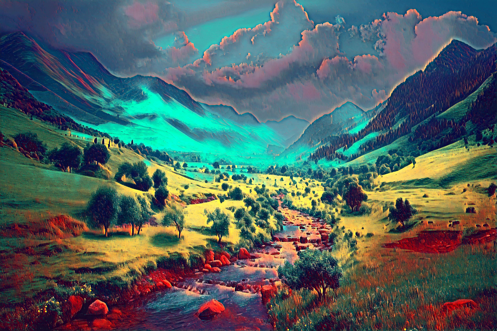
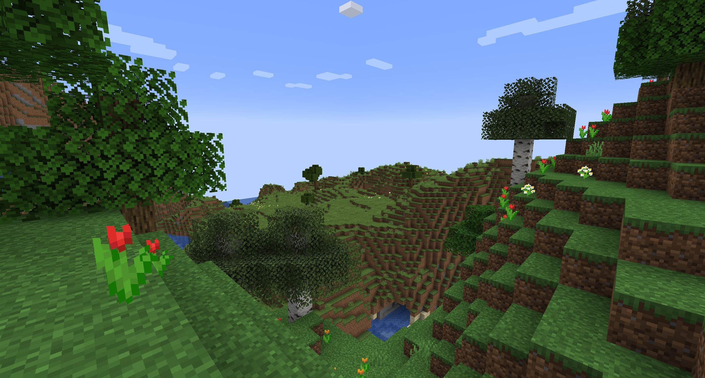
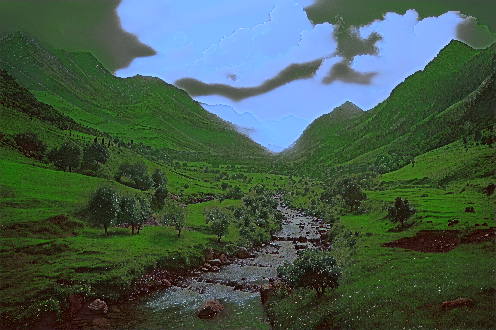

Reference code: https://github.com/jcjohnson/fast-neural-style

Dataset: https://www.kaggle.com/datasets/adityajn105/flickr8k

This project implements a Fast Neural Style Transfer to the Flickr8k dataset using different style images. How it works is that it trains to apply a specific image style to the entire dataset.
Then the learned style can be applied to an input image that matches the classifications of the dataset. In this case, Flickr8k is composed of various classifications and it was easier to train because it is small as compared to the COCO dataset which is originally used for this method.

Here are the results I got:

  
  
  

  
  
  

